# Hi there, I'm Muhammad Asif 👋

### CMS Developer & Team Lead | WordPress · Shopify · Laravel · Wix · Squarespace

I'm a full-stack CMS developer based in Karachi, Pakistan, with 5+ years of experience building custom websites, plugins, and web applications. I currently lead development teams delivering projects across WordPress, Shopify, HubSpot, Wix, and Squarespace.

- 🔭 Currently leading CMS projects as **Team Lead (CMS Developer)** at Media Revolution
- 🌱 Working with AI-assisted development (Laravel, Node.js) using Cursor & Copilot
- 🛠️ I build custom WordPress plugins & themes, integrate APIs, and optimize performance
- 🖥️ Experienced in domain, VPS hosting, and server deployment management
- 📫 Reach me: **muhammad1111asif@gmail.com** | 📱 +92 344 2509080

---

## 🧰 Tech Stack

### Languages & Markup

### Frameworks & Libraries

### CMS & Platforms

---

## 💼 Experience

**Team Lead — CMS Developer** · Media Revolution, Karachi · *Apr 2025 – Apr 2026*
Oversee HubSpot, Shopify, WordPress, Wix & Squarespace projects. Lead a developer team, handle Wix Velo custom coding, AI-assisted development, and manage domains, VPS hosting & server deployments.

**Team Lead — CMS Developer** · Matrix Analytics, Karachi · *Sep 2023 – Apr 2025*
Built custom solutions, API integrations & performance optimization across WordPress, Shopify, Webflow, Wix, Squarespace & HubSpot. Developed custom WordPress plugins and themes.

**Executive — Backend Developer** · AIMVIZ, Karachi · *Sep 2022 – Aug 2023*
Converted HTML layouts to WordPress, built custom plugins, and implemented enterprise content platforms using PHP, JavaScript, AJAX & jQuery.

**Junior Web App Developer** · P2P Track, Karachi · *May 2021 – Sep 2022*
Built web layouts, managed CI/CD & pull requests, and developed content platforms with Core PHP, JavaScript, AJAX, jQuery & MySQL.

---

## 🚀 Featured Projects

| Project | Stack |
|---------|-------|
| **Shipsearch** | HTML, CSS, JS, PHP |
| **Document Key** | HTML, CSS, JS, PHP |
| **Auto Fill Form System** | WordPress Plugin |

### 🌐 Selected Client Sites
- [lullababyusa.com](https://lullababyusa.com/) — Shopify (PageFly)
- [bellarinj.com](https://www.bellarinj.com/) — WordPress
- [johnskillerprotein.com](https://johnskillerprotein.com/) — WordPress
- [mayashinebooks.com](https://mayashinebooks.com/) — WordPress
- [360socialmedia.ca](https://360socialmedia.ca/) — WordPress
- [washingtonsdetailing.com](https://www.washingtonsdetailing.com/) — Wix
- [virtualmike.ai](https://virtualmike.ai/) — Webflow
- [elegantewesternwear.com](https://elegantewesternwear.com/) · [thestoreonline.com.au](https://thestoreonline.com.au/) · [usforcestactical.com](https://usforcestactical.com/) · [tacbolt.com](https://tacbolt.com/)

---

## 🎓 Education

- **Diploma in IT** — Aligarh Institute of Technology, Karachi (2018)
- **ADS (Engineering)** — Shah Abdul Latif University, Khairpur (2020–2023)
- **Mobile Application & Web Development** — Aptech Learning Center

---

## 📊 GitHub Metrics

<!-- This image is generated automatically by the Metrics GitHub Action (.github/workflows/metrics.yml).
     It will appear here after the workflow runs successfully for the first time. -->

---

## 📫 Connect With Me

